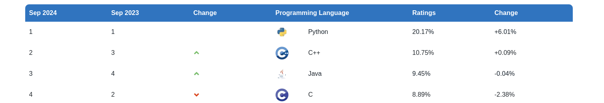
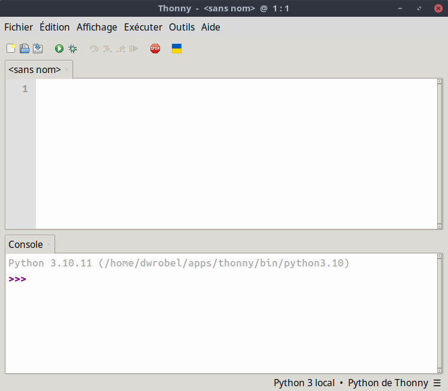
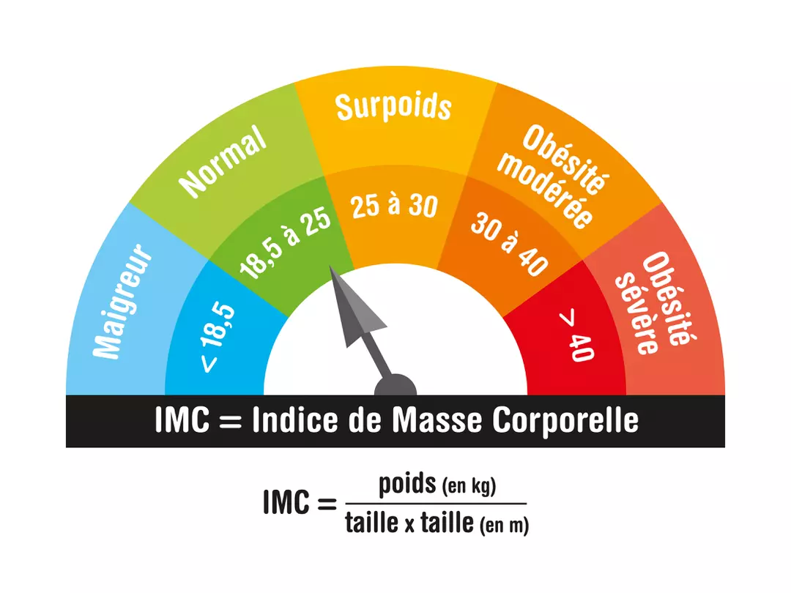

# Premiers pas avec Python

On s'intéresse dans ce TP à la programmation en Python.

    

Python s'affiche encore cette année comme un des langages préférés (si ce n'est le préféré) des utilisateurs :

    

## Découvrir l'environnement 

### Thonny

Pour programmer en Python, on peut utiliser le logiciel **Thonny** qui possède une interface simpliste :

    

Il possède deux zones principales qui ont chacune un rôle essentiel :

- la **zone de script** (la zone supérieure) : où on écrit des codes complets ;
- la **console** (la zone inférieure) : où on écrit des instructions et où on y obtient des résultats.

### Premières instructions

La console est une calculatrice géante qui permet la réalisation de calculs assez conséquent.  
Python sait gérer :

- les additions avec l'opérateur `+` ;
- les soustractions avec l'opérateur `-` ;
- les multiplications avec l'opérateur `*` ;
- les divisions avec l'opérateur `/` ;
- les puissances avec l'opérateur `**`.

!!! question "Pour commencer"

    1. Dans la console, taper `1+2*3` et vérifier que vous obtenez bien `7`.
    2. Pour avoir le résultat de l'expression $2\times 3^2-4\times\frac{20}{3}$, taper `2*3**2-4*20/3`.
    3. Taper l'instruction `2024**200` pour observer la valeur de $2024^{200}$.

Si vous devez utiliser d'autres fonctions comme **la racine carrée**, il vous faut l'importer depuis le module **maths**

!!! question "D'autres fonctions"

    1. Dans la console, taper `from math import sqrt` pour importer la racine carrée.
    2. Vérifier que l'instruction `sqrt(36)` vous renvoie bien `6.0`
    3. Vérifier que l'instruction `sqrt(2)**2` ne renvoie pas `2.0` comme cela aurait dû se produire.

### Utiliser des scripts

Dans la zone de script, il est possible de définir ses propres fonctions puis de les utiliser dans la console.

    

Commencer par télécharger le fichier [script1.py](<./files/script1.py>), puis l'ouvrir avec Thonny.  
Ce script permet de définir une fonction appelée **f** et définie par 

$$
f(x) = 2x-4
$$

Après avoir **exécuter** le script à l'aide de , taper dans la console `f(5)`, puis `f(2)` et enfin `f(f(3)-1)`.

!!! question "Définir ses fonctions"

    Dans le même script qu'au dessus, définir les fonctions :

    1. $g$ définie par $g(x) = x^2-3x+1$ ;
    2. $h$ définie par $h(x) = \dfrac{2x+6}{3x-2}$ ;
    3. $i$ définie par $i(x) = \sqrt{6x^2-2}$.

    Vérifier alors que les instructions `g(4)`, `h(4)` et `i(1)` fournissent les valeurs `5`, `1.2` et `2.0`.

## Pour aller plus loin

### Utiliser d'autres objets

Python sait également manipuler des chaînes de caractères et des listes d'éléments.

!!! question "Quelques tests"

    1. Dans la console, taper `c = "Lycée Colbert"` puis valider avec Entrée.
    2. Tester les instructions `c+c` ou encore `4*c`.
    3. Tester les instructions `len(c)` puis `c.count('e')`.

Une liste d'éléments se définie à l'aide de crochets `[]` comme dans l'instruction `L = [22, 7, 87]`.

!!! question "Tests sur les listes"

    1. Vérifier que `len(L)` renvoie `3`.
    2. Tester les instructions `L[0]`, `L[1]` et `L[2]`.
    3. Tester les instructions `L.append(2024)` et observer le  changement sur la liste `L`.

### Le bloc conditionnel

En Python, il est possible de réaliser des actions différentes suivant qu'une condition soit vraie ou fausse.  
On réalise cela à l'aide d'un bloc conditionnel `if ... else ...`.

Commencer par télécharger le fichier [script2.py](<./files/script2.py>), puis l'ouvrir avec Thonny.
Ce script définie deux fonctions :

- une fonction IMC qui calcule l'IMC d'une personne ;
- une fonction avis_IMC qui commente l'IMC d'une personne.

On rappelle que l'IMC est **l'indice de masse corporelle** est que l'on a :

    

!!! question "Script IMC"

    1. Compléter la fonction `IMC` à l'aide de la formule ;
    2. Compléter la fonction `avis_IMC` à l'aide du graphique.
    3. Vérifier l'avis d'IMC d'une personne mesurant 1.75m et pesant 82kg.